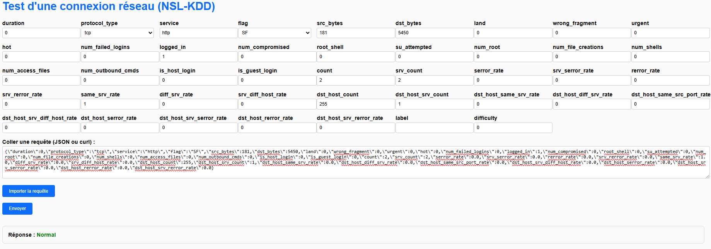
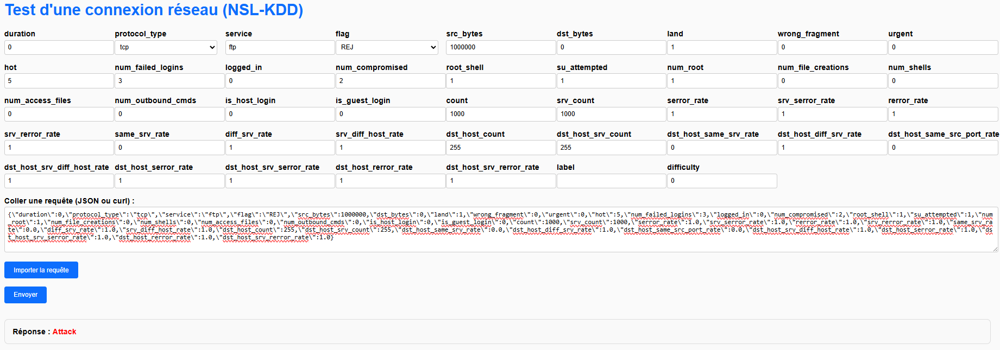

# NSL-KDD Intrusion Detection (Flask Demo)

This project trains a binary classifier on the NSL-KDD dataset and exposes a small Flask API with a web form for interactive predictions.

## Screenshots




## Interface

The web UI is served by the Flask app and lets you fill the NSL-KDD feature set directly in a form. You can also paste a JSON or curl payload, import it into the form, and send it to the `/predict` endpoint. The response is displayed as either `normal` or `attack`.

## Dataset

The project uses the NSL-KDD dataset:
- `KDDTrain+.txt` and `KDDTest+.txt` are expected in the repository root or in `train_save/`.
- The dataset provides 41 network features plus the `label` and `difficulty` columns.
- The training script drops `difficulty` and converts `label` into a binary target: `normal` -> 0, everything else -> 1.

## Model training

Training is implemented in `train_save/train_and_save.py` and includes:
- A preprocessing pipeline with `ColumnTransformer`
  - Numeric features: `StandardScaler`
  - Categorical features (`protocol_type`, `service`, `flag`): `OneHotEncoder`
- A `RandomForestClassifier`
- A small `GridSearchCV` over `n_estimators` and `max_depth`

The trained pipeline is saved as `model_pipeline.joblib` in the repository root so the Flask app can load it directly.

## Inference API

The Flask app in `app/app.py` exposes:
- `GET /` -> the HTML form
- `GET /ping` -> health check
- `POST /predict` -> JSON payload (single dict or list of dicts)

`app/app.py` looks for the model file in `app/` or in the parent directory.

## Run locally

Install dependencies:

```bash
pip install -r app/requirement.txt
```

Optional training (uses local dataset files):

```bash
python train_save/train_and_save.py
```

Run the API + UI:

```bash
python app/app.py
```

Then open `http://localhost:5000`.

## Exemples de requetes

Attaque:

```json
{
  "duration": 0,
  "protocol_type": "tcp",
  "service": "ftp",
  "flag": "REJ",
  "src_bytes": 1000000,
  "dst_bytes": 0,
  "land": 1,
  "wrong_fragment": 0,
  "urgent": 0,
  "hot": 5,
  "num_failed_logins": 3,
  "logged_in": 0,
  "num_compromised": 2,
  "root_shell": 1,
  "su_attempted": 1,
  "num_root": 1,
  "num_file_creations": 0,
  "num_shells": 0,
  "num_access_files": 0,
  "num_outbound_cmds": 0,
  "is_host_login": 0,
  "is_guest_login": 0,
  "count": 1000,
  "srv_count": 1000,
  "serror_rate": 1.0,
  "srv_serror_rate": 1.0,
  "rerror_rate": 1.0,
  "srv_rerror_rate": 1.0,
  "same_srv_rate": 0.0,
  "diff_srv_rate": 1.0,
  "srv_diff_host_rate": 1.0,
  "dst_host_count": 255,
  "dst_host_srv_count": 255,
  "dst_host_same_srv_rate": 0.0,
  "dst_host_diff_srv_rate": 1.0,
  "dst_host_same_src_port_rate": 0.0,
  "dst_host_srv_diff_host_rate": 1.0,
  "dst_host_serror_rate": 1.0,
  "dst_host_srv_serror_rate": 1.0,
  "dst_host_rerror_rate": 1.0,
  "dst_host_srv_rerror_rate": 1.0
}
```

Normal:

```json
{
  "duration": 0,
  "protocol_type": "tcp",
  "service": "http",
  "flag": "SF",
  "src_bytes": 181,
  "dst_bytes": 5450,
  "land": 0,
  "wrong_fragment": 0,
  "urgent": 0,
  "hot": 0,
  "num_failed_logins": 0,
  "logged_in": 1,
  "num_compromised": 0,
  "root_shell": 0,
  "su_attempted": 0,
  "num_root": 0,
  "num_file_creations": 0,
  "num_shells": 0,
  "num_access_files": 0,
  "num_outbound_cmds": 0,
  "is_host_login": 0,
  "is_guest_login": 0,
  "count": 2,
  "srv_count": 2,
  "serror_rate": 0.0,
  "srv_serror_rate": 0.0,
  "rerror_rate": 0.0,
  "srv_rerror_rate": 0.0,
  "same_srv_rate": 1.0,
  "diff_srv_rate": 0.0,
  "srv_diff_host_rate": 0.0,
  "dst_host_count": 255,
  "dst_host_srv_count": 1,
  "dst_host_same_srv_rate": 0.0,
  "dst_host_diff_srv_rate": 0.0,
  "dst_host_same_src_port_rate": 0.0,
  "dst_host_srv_diff_host_rate": 0.0,
  "dst_host_serror_rate": 0.0,
  "dst_host_srv_serror_rate": 0.0,
  "dst_host_rerror_rate": 0.0,
  "dst_host_srv_rerror_rate": 0.0
}
```
